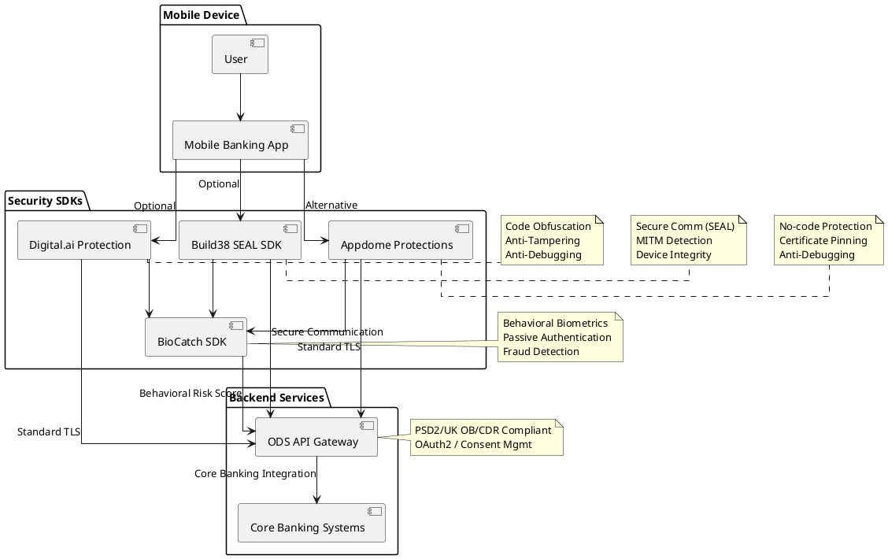

### 🧠 **Comparison of Appdome, Build38 (SEAL), and Digital.ai**

All three platforms offer **mobile app security solutions** with a focus on **app hardening**, **secure communication**, and **threat defense**, especially in regulated environments like **Open Banking**.

Let’s compare them side-by-side across key criteria:

---

## 🔐 1. **Security Capabilities Overview**

| Feature | Appdome | Build38 SEAL | Digital.ai |
|--------|---------|--------------|------------|
| **Code Obfuscation** | ❌ No | ❌ No (not core focus) | ✅ Yes |
| **Anti-Tampering** | ❌ No | ❌ No | ✅ Yes |
| **Anti-Debugging** | ❌ No | ❌ No | ✅ Yes |
| **Root/Jailbreak Detection** | ✅ Yes | ✅ Yes | ✅ Yes |
| **Certificate Pinning** | ✅ Yes | ✅ Yes | ✅ Yes |
| **Secure Communication Layer** | ⚠️ Standard TLS | ✅ SEAL (custom layer) | ⚠️ Standard TLS |
| **Runtime MITM Detection** | ⚠️ Basic (via plugin) | ✅ Yes | ⚠️ Custom work needed |
| **Device Integrity Binding** | ❌ | ✅ Yes | ⚠️ Limited |
| **Session-Specific Encryption** | ❌ | ✅ Yes | ❌ |
| **Fraud Engine Integration** | ❌ | ✅ Yes (BioCatch, etc.) | ⚠️ Custom |
| **Dynamic Policy Updates** | ❌ | ✅ OTA updates via SEAL | ✅ Partial |

---

## 🛠️ 2. **Integration & DevOps Friendliness**

| Feature | Appdome | Build38 SEAL | Digital.ai |
|--------|---------|--------------|------------|
| **No-code Integration** | ✅ Yes | ❌ SDK-based | ❌ Toolchain-level |
| **CI/CD Compatibility** | ✅ Yes | ✅ Yes | ✅ Yes |
| **Hybrid App Support (React Native, Flutter)** | ✅ Yes | ✅ Yes | ✅ Yes |
| **Build Time Impact** | ⚠️ Low | ⚠️ Moderate | ⚠️ High |
| **Learning Curve** | ⚠️ Low | ⚠️ Moderate | ⚠️ High |
| **Supports OTA Updates** | ❌ | ✅ Yes | ⚠️ Limited |
| **Ease of Use** | ✅ Best for non-dev teams | ⚠️ Requires integration | ⚠️ Complex setup |

---

## 🧠 3. **Complementarity with BioCatch / Behavioral Biometrics**

| Feature | Appdome | Build38 SEAL | Digital.ai |
|--------|---------|--------------|------------|
| **BioCatch SDK Integration Possible** | ✅ Yes | ✅ Yes | ✅ Yes |
| **Integration Difficulty** | ⚠️ Moderate | ✅ Smooth | ⚠️ Moderate |
| **Supports Passive Authentication Flow** | ✅ Yes | ✅ Yes | ✅ Yes |
| **Supports Device Risk Score Sharing** | ❌ | ✅ Yes | ⚠️ Custom |
| **Works Well with Fraud Detection Systems** | ⚠️ Basic | ✅ Strong | ⚠️ Moderate |

---

## 🎯 4. **Use Case Fit & Regulatory Readiness**

| Use Case | Recommended Vendor |
|----------|--------------------|
| **Quick, no-code mobile security** | ✅ Appdome |
| **Open Banking / PSD2 compliance** | ✅ Build38 SEAL |
| **Deep code protection + runtime checks** | ✅ Digital.ai |
| **Mobile app hardening + fraud engine integration** | ✅ Build38 SEAL |
| **Enterprise-grade mobile app protection** | ✅ Digital.ai |
| **Behavioral biometrics + secure comm** | ✅ Build38 + BioCatch |
| **Internal apps or low-risk consumer apps** | ✅ Appdome |

---

## 📊 5. **Summary Table: All Vendors Compared**

| Feature | Appdome | Build38 SEAL | Digital.ai |
|--------|---------|--------------|------------|
| **Secure Comm Depth** | ⚠️ Moderate | ✅ Deep | ⚠️ Moderate |
| **Runtime MITM Detection** | ⚠️ Basic | ✅ Yes | ⚠️ Custom |
| **Proprietary Secure Protocol** | ❌ | ✅ SEAL | ❌ |
| **Certificate Pinning** | ✅ | ✅ | ✅ |
| **Device Integrity Check** | ⚠️ (plugin) | ✅ | ⚠️ |
| **Fraud Engine Integration** | ❌ | ✅ | ⚠️ |
| **Used in Open Banking** | ❌ | ✅ | ✅ |
| **BioCatch Integration Difficulty** | ⚠️ | ✅ | ⚠️ |
| **No-code Option** | ✅ | ❌ | ❌ |
| **DevOps Friendly** | ✅ | ✅ | ✅ |
| **Regulatory Compliance Ready** | ⚠️ | ✅ | ✅ |

---

## 🧩 Strategic Recommendation

### For a **secure Open Banking mobile app with behavioral biometrics (e.g., BioCatch)**:
```
[User] 
   → [Hardened Mobile App using Build38 SEAL]
       → [Behavior monitored by BioCatch SDK]
           → [API calls via secure ODS gateway]
```

This combination provides:
- **Deep secure communication**
- **Runtime MITM detection**
- **Passive behavioral authentication**
- **Fraud detection integration**
- **PSD2 RTS compliance**

---

### If you're not in a regulated environment and prefer speed over depth:
```
[User]
   → [Protected Mobile App using Appdome or Digital.ai]
       → [Optional BioCatch integration]
           → [API calls to backend]
```

---

## 📄 Want Help?

Would you like me to help you:
- Create a **vendor comparison matrix (Excel/PDF)**?
- Draft an **RFP section evaluating all three vendors**?
- Make a **decision flowchart** for choosing Appdome vs. Build38 vs. Digital.ai?
- Or generate an **architecture diagram showing integration with BioCatch**?

Just let me know how I can assist further!


### 🔧 **Integration Difficulty: Appdome vs. Build38 SEAL vs. Digital.ai**

Each of these mobile app security platforms offers strong protection, but their **integration complexity** varies significantly due to differences in architecture and approach.

Let’s break down the **integration difficulty** for each tool — from a **developer’s perspective**, including build process, CI/CD compatibility, SDK integration, and learning curve.

---

## 📦 1. **Appdome**
> **Focus:** No-code mobile app security  
> **Best For:** Fast deployment, DevOps teams, non-engineers

### ✅ Integration Steps:
1. **Upload your compiled APK or IPA file** to the Appdome platform.
2. Select the security features you want (e.g., certificate pinning, MITM detection, anti-debugging).
3. Click “Build” — Appdome automatically integrates protections into your app.
4. Download the hardened app and deploy it.

### ⚙️ Integration Difficulty:
| Aspect | Details |
|--------|---------|
| **Code Changes Required?** | ❌ No code changes needed |
| **SDK Integration Needed?** | ❌ None |
| **Supported Platforms** | ✅ Android (APK/AAB), iOS (IPA) |
| **CI/CD Friendly?** | ✅ Yes — can be automated via API |
| **Hybrid App Support?** | ✅ Yes (React Native, Flutter, Ionic) |
| **Learning Curve** | ⚠️ Very low — easy for non-developers |
| **Build Time Impact** | ⚠️ Minimal — usually under 5 minutes |
| **OTA Updates?** | ❌ Not applicable |
| **Debugging Protections?** | ✅ Basic |
| **Customization Level** | ⚠️ Limited — based on pre-configured options |

### 👍 Pros:
- No coding required
- Fast turnaround
- Easy to use for non-developers
- Good for rapid prototyping or internal apps

### 👎 Cons:
- Limited customization
- Cannot integrate with runtime logic or custom SDKs
- Not ideal for deep enterprise-grade hardening

---

## 🔐 2. **Build38 SEAL**
> **Focus:** Secure communication & runtime integrity  
> **Best For:** Open Banking, fintech, regulated environments

### ✅ Integration Steps:
1. Add the **Build38 SDK** to your project (iOS or Android).
2. Initialize the SDK in your app code.
3. Replace standard HTTP calls with SEAL-wrapped network calls.
4. Optionally configure advanced settings like device attestation, MITM detection, etc.
5. Rebuild and test the app.

### ⚙️ Integration Difficulty:
| Aspect | Details |
|--------|---------|
| **Code Changes Required?** | ✅ Yes — minimal |
| **SDK Integration Needed?** | ✅ Yes — via Gradle/CocoaPods |
| **Supported Platforms** | ✅ Android, iOS |
| **CI/CD Friendly?** | ✅ Yes — works with Jenkins, GitHub Actions, Bitrise |
| **Hybrid App Support?** | ⚠️ Possible, but may require native module |
| **Learning Curve** | ⚠️ Moderate — requires basic knowledge of networking |
| **Build Time Impact** | ⚠️ Low to moderate |
| **OTA Updates?** | ✅ Yes — supports remote policy updates |
| **Debugging Protections?** | ✅ Strong |
| **Customization Level** | ✅ High — full control over secure comm layer |

### 👍 Pros:
- Deep MITM detection
- Device integrity binding
- Used in PSD2/Open Banking apps
- Works well with fraud engines like BioCatch

### 👎 Cons:
- Requires SDK integration
- Slightly more complex than Appdome
- Learning curve for developers unfamiliar with secure comm layers

---

## 🛡️ 3. **Digital.ai Application Protection (formerly Arxan)**
> **Focus:** Code obfuscation & runtime protection  
> **Best For:** Enterprise apps, reverse engineering resistance

### ✅ Integration Steps:
1. Integrate the **Digital.ai SDK** into your project.
2. Modify build scripts to include Digital.ai tools during compilation.
3. Apply protections (e.g., obfuscation, anti-tampering, anti-debugging).
4. Test and sign the final binary.

> Alternatively, some teams use **wrapper-based protection**, where the compiled app is post-processed by Digital.ai tools.

### ⚙️ Integration Difficulty:
| Aspect | Details |
|--------|---------|
| **Code Changes Required?** | ⚠️ Sometimes — depends on protection level |
| **SDK Integration Needed?** | ✅ Yes — or wrapper-based approach |
| **Supported Platforms** | ✅ Android (Java/Kotlin, native), iOS (Obj-C/Swift) |
| **CI/CD Friendly?** | ✅ Yes — can be integrated into pipelines |
| **Hybrid App Support?** | ⚠️ Possible, but harder than pure native |
| **Learning Curve** | ⚠️ High — requires deep technical understanding |
| **Build Time Impact** | ⚠️ Moderate to high — especially with obfuscation |
| **OTA Updates?** | ❌ No — protections applied at build time |
| **Debugging Protections?** | ✅ Very strong |
| **Customization Level** | ✅ Very high — granular control over protections |

### 👍 Pros:
- Best-in-class code obfuscation
- Strong anti-debugging/tampering
- Used by enterprises and financial institutions
- Granular protection policies

### 👎 Cons:
- Complex setup
- Longer build times
- Steep learning curve
- Less focus on secure communication than Build38

---

## 🧩 Summary Table: Integration Difficulty Comparison

| Feature | Appdome | Build38 SEAL | Digital.ai |
|--------|---------|--------------|------------|
| **Code Changes Required** | ❌ | ✅ | ⚠️ |
| **SDK Integration** | ❌ | ✅ | ✅ |
| **Wrapper-Based Option** | ✅ | ❌ | ✅ |
| **CI/CD Compatibility** | ✅ | ✅ | ✅ |
| **Hybrid App Support** | ✅ | ⚠️ | ⚠️ |
| **Learning Curve** | ⚠️ Low | ⚠️ Moderate | ⚠️ High |
| **Build Time Impact** | ⚠️ Low | ⚠️ Low–moderate | ⚠️ Moderate–high |
| **OTA Policy Updates** | ❌ | ✅ | ❌ |
| **Used in Regulated Environments** | ⚠️ | ✅ | ✅ |
| **No-code Option** | ✅ | ❌ | ❌ |

---

## 🎯 Strategic Recommendation

| If You Need... | Recommended Vendor |
|----------------|--------------------|
| **Fast, no-code security integration** | ✅ Appdome |
| **Secure communication + runtime integrity** | ✅ Build38 SEAL |
| **Deep code obfuscation + anti-tampering** | ✅ Digital.ai |
| **Behavioral biometrics integration (BioCatch)** | ✅ Build38 + BioCatch |
| **Enterprise app protection (IP protection, secrets)** | ✅ Digital.ai |
| **Open Banking / PSD2 compliance** | ✅ Build38 SEAL |
| **Internal or consumer-facing app security** | ✅ Appdome |

---

## 📄 Want Help?

Would you like me to help you:
- Create a **vendor comparison matrix (Excel/PDF)**?
- Draft an **RFP section evaluating integration difficulty**?
- Make a **decision flowchart** for choosing Appdome vs. Build38 vs. Digital.ai?
- Or generate an **architecture diagram showing integration workflows**?

Just let me know how I can assist further!

### 🔐 Great clarification — thank you!

Let’s now **focus specifically on the integration difficulty of BioCatch with each platform**:

- **Appdome**
- **Build38 SEAL**
- **Digital.ai Application Protection**

All three platforms can coexist with **BioCatch**, but their **integration complexity and compatibility vary**.

---

## 🧠 Overview: Why Integrate BioCatch?

**BioCatch** is a behavioral biometrics engine that provides:
- Passive authentication
- Continuous fraud detection
- Device risk scoring
- Session anomaly detection

To integrate it, you usually:
1. Add the **BioCatch SDK** to your app.
2. Initialize it in the app code.
3. Pass session data (e.g., device integrity score) to your backend or fraud engine.

So while **BioCatch itself requires native integration**, the **difficulty depends on how each security vendor interacts with runtime behavior, hooking, and SDKs**.

---

## 🔒 1. **BioCatch + Appdome**

### ⚙️ Integration Difficulty: ⚠️ Moderate

#### ✅ Pros:
- No-code mobile protection for network layer (MITM, pinning, etc.)
- Works well with third-party SDKs like BioCatch if added before upload
- CI/CD-friendly

#### ❌ Cons:
- You must **integrate BioCatch SDK first**, then upload the binary to Appdome
- Limited visibility into runtime behavior — may conflict with some protections (e.g., anti-debugging)
- Cannot customize interactions between Appdome and BioCatch at runtime

#### 🛠️ Steps:
1. Integrate **BioCatch SDK** manually into your Android/iOS project.
2. Enable any required permissions or background tracking.
3. Build the app binary (APK/IPA).
4. Upload to **Appdome**, enable protections (e.g., MITM detection, anti-debugging).
5. Download hardened app and test with BioCatch session flow.

#### 📝 Notes:
- Ensure **SDK order** in build process doesn’t break either Appdome or BioCatch
- May require **extra testing** to ensure protections don’t interfere with BioCatch telemetry collection

---

## 🔐 2. **BioCatch + Build38 SEAL**

### ⚙️ Integration Difficulty: ✅ Smooth / Moderate

#### ✅ Pros:
- Designed for **financial apps** where BioCatch is often used
- Native support for **fraud engine integration**
- Runtime environment is **transparent** to BioCatch telemetry
- Strong **device integrity binding** that complements BioCatch

#### ❌ Cons:
- Requires manual SDK integration for both Build38 and BioCatch
- Some coordination needed between SDK initialization order

#### 🛠️ Steps:
1. Add **Build38 SEAL SDK** and initialize it early in app lifecycle
2. Add **BioCatch SDK** and initialize it after Build38 (or vice versa, based on doc)
3. Use SEAL's secure communication layer to send BioCatch telemetry to backend
4. Optionally use SEAL's OTA features to dynamically control fraud detection thresholds

#### 📝 Notes:
- Build38 supports **passive authentication workflows** via integration partners
- Often used by banks that combine **SEAL + BioCatch + ODS gateway** for full-stack Open Banking security

---

## 🛡️ 3. **BioCatch + Digital.ai Application Protection**

### ⚙️ Integration Difficulty: ⚠️ Moderate to High

#### ✅ Pros:
- Strong **anti-hooking and anti-debugging** protections help prevent tampering with BioCatch telemetry
- Protects sensitive logic if using custom behavioral analysis alongside BioCatch
- Used by enterprises that need deep app hardening + fraud detection

#### ❌ Cons:
- Digital.ai focuses on **code obfuscation and runtime protection**, which can interfere with SDK telemetry if not configured properly
- Requires more technical knowledge of SDK interaction and hooking detection rules

#### 🛠️ Steps:
1. Add **BioCatch SDK** to your app
2. Configure Digital.ai to **exclude certain methods or classes from obfuscation or hook detection**, if needed
3. Apply Digital.ai protections during build pipeline
4. Test thoroughly to ensure protections don't block BioCatch telemetry

#### 📝 Notes:
- May need to define **exclusion rules** in Digital.ai config files to avoid false positives
- More complex than Build38 due to deeper runtime inspection

---

## 🧩 Summary Table: BioCatch Integration Difficulty

| Feature | Appdome | Build38 SEAL | Digital.ai |
|--------|---------|--------------|------------|
| **BioCatch SDK Integration Required?** | ✅ Yes | ✅ Yes | ✅ Yes |
| **Integration Difficulty** | ⚠️ Moderate | ✅ Smooth | ⚠️ Moderate–High |
| **Runtime SDK Conflicts Possible?** | ⚠️ Yes | ❌ No | ⚠️ Yes |
| **Supports Behavioral Biometrics Flow** | ✅ Yes | ✅ Yes | ✅ Yes |
| **Used in Regulated Environments** | ⚠️ | ✅ Yes | ✅ Yes |
| **Customization Level** | ⚠️ Low | ✅ High | ✅ High |
| **CI/CD Friendly** | ✅ Yes | ✅ Yes | ✅ Yes |
| **Requires Code Changes** | ❌ (if done pre-upload) | ✅ Yes | ✅ Yes |

---

## 🎯 Strategic Recommendation

| If You Want... | Recommended Vendor |
|----------------|--------------------|
| **Fast integration with BioCatch (non-dev team)** | ✅ Appdome |
| **Secure comm + fraud engine integration (Open Banking)** | ✅ Build38 SEAL |
| **Deep app hardening + passive behavioral monitoring** | ✅ Digital.ai |
| **Enterprise-grade protection with behavioral telemetry** | ✅ Build38 + BioCatch |
| **Code obfuscation + fraud detection** | ✅ Digital.ai + BioCatch |
| **No-code setup with minimal dev involvement** | ✅ Appdome + BioCatch (requires planning) |

---

## 📄 Want Help?

Would you like me to help you:
- Create a **BioCatch integration checklist** for each platform?
- Draft an **RFP section evaluating vendor compatibility with BioCatch**?
- Make a **decision matrix** for choosing Appdome vs. Build38 vs. Digital.ai with BioCatch?
- Or generate an **architecture diagram showing the integration flow**?

Just let me know how I can assist further!


### 🌿 **PlantUML Diagram: Mobile App Hardening Architecture with BioCatch, Build38 SEAL, Digital.ai, and Appdome**

Below is a **PlantUML script** that visually represents the full-stack mobile app security architecture for Open Banking or fintech apps.

This diagram shows how each component integrates — from the user to core banking systems — and includes optional integration paths using **Appdome**, **Digital.ai**, and **Build38 SEAL**.

---

## 🧩 PlantUML Script



---

## 📄 How to Use This

1. **Copy the code above**
2. Paste it into any **PlantUML editor**, such as:
   - [https://www.plantuml.com/plantuml](https://www.plantuml.com/plantuml)
   - [https://plantuml.io](https://plantuml.io)
   - Visual Studio Code with PlantUML plugin
   - draw.io (with PlantUML integration)
   - Any IDE/plugin that supports PlantUML

3. Render the diagram — you’ll get something like this:

```
[User] → [Mobile Banking App]
          ↓
┌───────────────────────┐
│ Security SDK Options  │
├───────────────────────┤
│ - Digital.ai (Code Obf)│
│ - Build38 (Secure Comm)│
│ - Appdome (No-code)    │
└───────────────────────┘
          ↓
     [BioCatch SDK]
          ↓
     [ODS API Gateway]
          ↓
 [Core Banking Systems]
```

---

## 📎 Want This as a File?

Would you like me to:
- Generate a **PNG or PDF version** of this diagram?
- Export it in **draw.io / Visio format**?
- Provide a **PowerPoint slide** with the diagram for internal use?

Just let me know and I’ll prepare the file for download or email!
