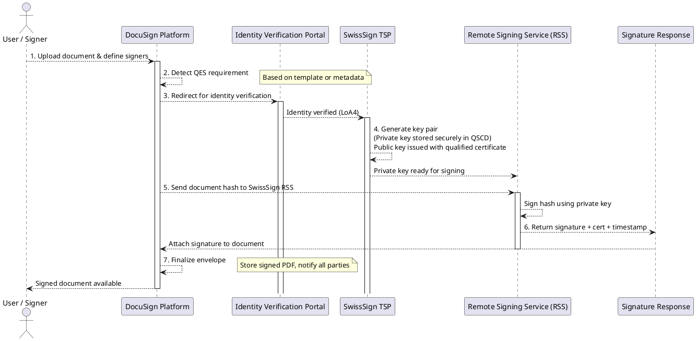

Absolutely! Here's a **detailed diagram** of **Model B**, where **SwissSign stores and uses the private key** as part of a **Remote Signing Service (RSS)**, while you use **DocuSign for document management and workflow**.

This model is ideal when your organization prefers not to manage HSMs or PKI infrastructure but still needs **Qualified Electronic Signatures (QES)** under **eIDAS Regulation**.

---

## 🧾 Model B: SwissSign-Managed Private Key (Remote Signing)

### 📊 Diagram (Text Version – Copy into draw.io / Visio / Lucidchart)

```
+---------------------+
|     User / Signer   |
|  (Uploads document  |
|   via DocuSign UI)  |
+----------+----------+
           |
           | 1. Upload document & define signers
           v
+-----------------------------+
|     DocuSign Platform       |
|  (Document management,      |
|   routing, templates)       |
+--------------+--------------+
               |
               | 2. Detect QES requirement
               v
+-------------------------------+
|    Redirect to SwissSign      |
|  Identity Verification Portal |
|  (In-person or remote LoA4)   |
+-------------------------------+
               |
               | 3. Identity verified by SwissSign
               v
+-------------------------------+
| SwissSign Generates Key Pair  |
| - Private key stored securely |
|   in SwissSign’s QSCD         |
| - Public key bound to signer  |
+-------------------------------+
               |
               | 4. Qualified certificate issued
               v
+-------------------------------+
|     Send Document Hash        |
|   to SwissSign Remote Signing |
|          Service (RSS)        |
+-------------------------------+
               |
               | 5. SwissSign signs hash using private key
               v
+-------------------------------+
| SwissSign Returns Signature + |
|   Certificate + Timestamp     |
+-------------------------------+
               |
               | 6. Final signed PDF uploaded to DocuSign
               v
+-----------------------------+
|     DocuSign Platform       |
|  (Finalize envelope, notify |
|   all parties, store signed |
|   document)                 |
+-----------------------------+
```

---

## 🔁 Step-by-Step Flow (with Signing Key Managed by SwissSign)

### ✅ Step 1: User Uploads Document in DocuSign

- The user uploads a document requiring **QES-level signature**
- One or more signers are marked for QES signing

### ✅ Step 2: DocuSign Detects QES Requirement

- Based on template rules, DocuSign detects that a **QES is required**
- It triggers a special signing flow

### ✅ Step 3: Redirect to SwissSign for Identity Verification

- The system redirects the signer to a **SwissSign verification portal**
- The signer completes **Level of Assurance 4 (LoA4)** identity verification:
  - In-person at SwissSign office
  - Or via secure remote verification with biometrics and ID upload

### ✅ Step 4: SwissSign Generates Key Pair

- After verification, SwissSign:
  - **Generates a key pair**
  - Stores the **private key securely** in their own **Qualified Signature Creation Device (QSCD)**
  - Issues a **qualified certificate** linked to your identity

> 🔐 You never see or handle the private key — it remains in SwissSign’s secure environment.

### ✅ Step 5: Send Document Hash to SwissSign RSS

- When it's time to sign:
  - DocuSign generates a **hash of the document** (e.g., SHA-256)
  - Sends it to SwissSign via an API (or redirect UI)
  - SwissSign uses the **private key** to digitally sign the hash

### ✅ Step 6: SwissSign Returns Signed Result

- SwissSign returns:
  - Digital signature value
  - Attached qualified certificate
  - Optional timestamp from a **qualified TSA**

### ✅ Step 7: Final Signed Document Uploaded to DocuSign

- The final PDF with full QES metadata is uploaded back to DocuSign
- All users receive the completed document
- Audit trail preserved

---

## 🛡️ Why This Is QES-Compliant

This setup meets all **eIDAS requirements** for a **Qualified Electronic Signature**:

| eIDAS Requirement | Met? | How |
|------------------|------|-----|
| Qualified Certificate | ✅ | Issued by SwissSign |
| Identity Verified at LoA4 | ✅ | In-person or remote verification |
| Signature Created in QSCD | ✅ | SwissSign’s HSM |
| Sole Control of Signer | ✅ | Identity bound to private key |
| Long-Term Validity | ✅ | Optional timestamping |

---

## 📦 Tools Involved

| Tool | Role |
|------|------|
| **DocuSign** | Document upload, workflow, storage |
| **SwissSign** | TSP issuing qualified certificates |
| **Remote Signing Service (RSS)** | Signs document hash using private key |
| **Optional: Qualified TSA** | Time-stamp authority for long-term validation |

---

## 📨 Want Help Implementing This?

Would you like assistance with any of the following?

1. 📄 Draft message to SwissSign asking about their **remote signing service (RSS)** and integration options?
2. 🧱 Architecture design for integrating SwissSign’s RSS with DocuSign?
3. 📋 RFP template for selecting a QTSP that supports **remote signing and QES issuance**?
4. 🧪 Sample API call between DocuSign and SwissSign’s RSS endpoint?

Let me know what you'd like next!

Great! Here's the **PlantUML version** of the **Model B diagram**, where **SwissSign stores and uses the private key** as part of a **Remote Signing Service (RSS)**, while **DocuSign** handles document management and workflow.

You can copy this code into any PlantUML editor (like [PlantUML Online](https://www.plantuml.com/plantuml/)) to generate the diagram.

---

## 🧾 PlantUML Diagram: Model B – SwissSign-Managed Private Key (Remote Signing)



---

## 🖼️ What This Diagram Shows

This sequence diagram illustrates:

1. **User uploads document via DocuSign UI**
2. **DocuSign detects QES requirement**
3. **Redirects user to SwissSign for identity verification (LoA4)**
4. **SwissSign generates key pair and issues qualified certificate**
5. **DocuSign sends document hash to SwissSign Remote Signing Service (RSS)**
6. **SwissSign signs hash using its own secure private key**
7. **Signed result returned and stored back in DocuSign**

---

## ✅ Why Use PlantUML?

- Easy to version control
- Fully text-based (no drag-and-drop tools)
- Integrates with Confluence, Git, CI/CD pipelines
- Can be converted to PNG/PDF/SVG programmatically

---

## 📨 Want More?

Would you like:
- 📄 A downloadable `.puml` file?
- 🧱 PlantUML architecture for Model A (enterprise-managed keys)?
- 📋 Exported PNG or SVG of this diagram?
- 🧪 Sample API call from DocuSign to SwissSign’s RSS endpoint?

Let me know what you'd like next!
